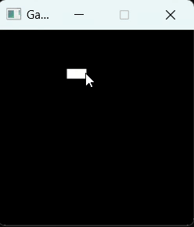

# Game of Life

A C++ implementation of Conway's Game of Life with graphical rendering using SDL2.

## Features
- **Dynamic grid**: Simulates the evolution of a grid based on Conway's Game of Life rules.
- **Interactive UI**: Click cells to toggle their state.
- **Pause/Resume**: Start and stop the simulation using the spacebar.
- **Efficient rendering**: Uses SDL2 for graphical representation.

## How It Works
The Game of Life is a cellular automaton devised by John Conway. The grid evolves according to these rules:
1. Any live cell with 2 or 3 live neighbors survives.
2. Any dead cell with exactly 3 live neighbors becomes a live cell.
3. All other live cells die, and all other dead cells remain dead.

## Controls
- **Left-click**: Toggle a cell's state (alive or dead).
- **Spacebar**: Pause or resume the simulation.
- **R**: Reinitialize the grid.

## Installation and Usage

### Prerequisites
- A C++ compiler (I recommend g++).
- SDL2 installed on your system.

### Build Instructions
1. Clone the repository:
    ```bash
    git clone https://github.com/your-username/GameOfLife.git
    cd GameOfLife
    ```

2. Open the `GameOfLife.sln` file in Visual Studio (or your preferred IDE).

3. Build and run the project.

### Running the Application
- The application starts in **pause mode**. Press `Spacebar` to begin the simulation.
- Modify the grid using your mouse and watch the simulation evolve!

## Demonstration


## Acknowledgments
Conway's Game of Life: [Wikipedia](https://en.wikipedia.org/wiki/Conway%27s_Game_of_Life)